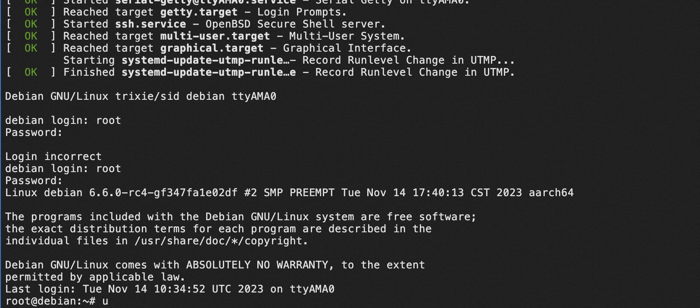

# Compiling Rust-for-Linux

## Environment And Dependencies:

- Ubuntu 22.04 LTS (rust for linux depends on at least `clang-11` ,Ubuntu 20 default clang version is `10.0.0`)
- Git
- QEMU for Arm64 (after version `7.2.0` you may meet the error `network backend 'user' is not compiled into this binary`, find solutions on https://wiki.qemu.org/ChangeLog/7.2#SLIRP_module_(user-mode_networking))
- Rust toolchain 
   
## Install the Rust toolchain:
``` 
curl --proto '=https' --tlsv1.2 -sSf https://sh.rustup.rs | sh -s -- -y

source $HOME/.cargo/env
```

## Clone the repository Rust-for-Linux/linux:

``` 
git clone https://github.com/Rust-for-Linux/linux.git rust-for-linux -b rust-dev
```
Install basic dependencies follow the tutorial: 
>https://github.com/schwartx/rcoreos-rust-for-linux/blob/main/exercise1.md 

then install the dependencies, run:

```make LLVM=1 rustavailable```

it will detects rust compile dependencies. solutions of the most errors can found in Documentation/rust/quick-start. Before compile, ensure you get the output (most errors are caused by missing bindgen): 

 ```Rust is available!```

generate default compile configuration  :

```make ARCH=arm64 LLVM=1 O=build defconfig```

Enter the compile configuration menu and select Rust support:

```make ARCH=arm64 LLVM=1 O=build menuconfig```

go to the build directory and start to compile kernel:

```cd build && make ARCH=arm64 LLVM=1 -j$(nproc)```

fortunately, no errors!

## Boot the Kernel

Once completed, download a arm64 OS image from https://people.debian.org/~gio/dqib/, for the command params you can read readme.txt.


Run the following command in ./build:

```qemu-system-aarch64 -machine 'virt' -cpu 'cortex-a57' -m 1G -device virtio-blk-device,drive=hd -drive file=$HOME/dqib_arm64-virt/image.qcow2,if=none,id=hd -device virtio-net-device,netdev=net -netdev user,id=net,hostfwd=tcp::2222-:22 -kernel arch/arm64/boot/Image.gz -initrd $HOME/dqib_arm64-virt/initrd -nographic -append "root=LABEL=rootfs console=ttyAMA0"```

Note: os and qemu arch must be same.

finally you can go to the debian login interface.
