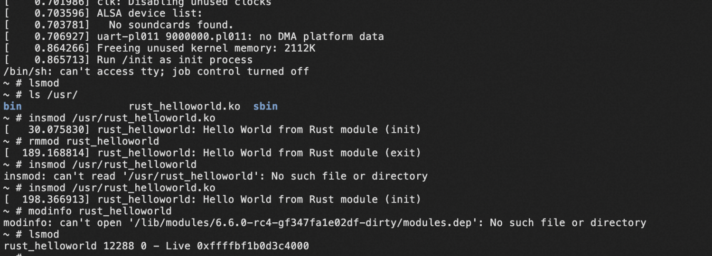

# Load Rust HelloWorld Module

## Write the Rust HelloWorld Module:

follow the tutorail https://github.com/rcore-os/rust-for-linux/blob/main/exercise2.md , write code
   
## Compile Kernel with Module Rust HelloWorld:

follow the totorial , compile Rust HelloWorld module，once completed，will find a file named rustrust_helloworld.ko in build/samples/rust


## Make initramfs with your module file
the easiest way to load the module is to copy your module file in the initrd file system and boot with it, it don not need to make 
the hd file system,another
two way is to make a full hd file
system or make a shared directory with qemu (key is make kernel find your module file)

follow the tutorial https://github.com/rcore-os/rust-for-linux/blob/main/initrd.md to make a initrd file ,don not forget to copy module before make initrd file


Once completed, Run the following command with right path:

```qemu-system-aarch64 -M virt -cpu cortex-a72 -smp 8 -m 128M -kernel $HOME/linux/build/arch/arm64/boot/Image -initrd ../initramfs.cpio.gz -nographic -append "init=/init console=ttyAMA0"```


finally you can see the module info about rust hello world.

