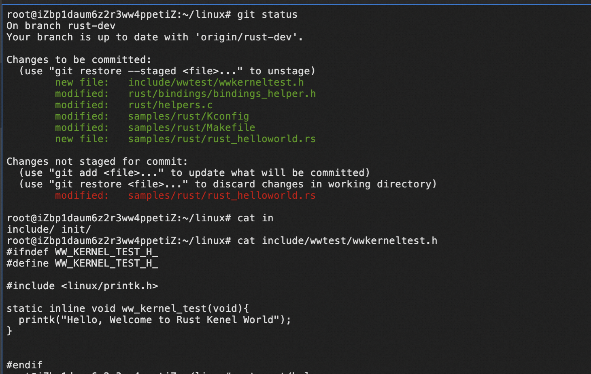
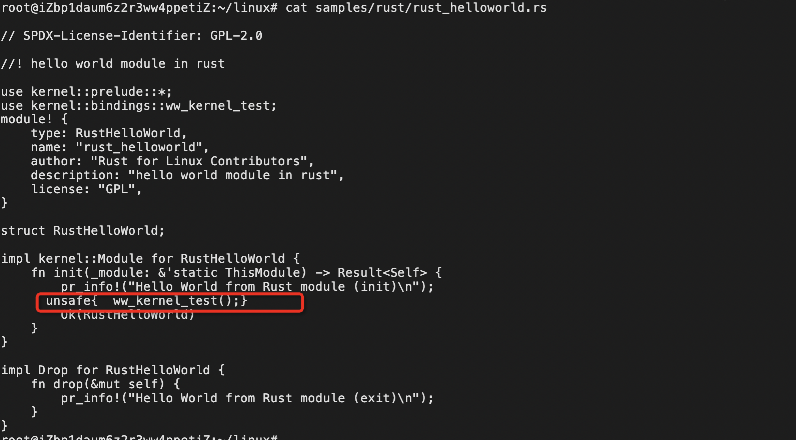
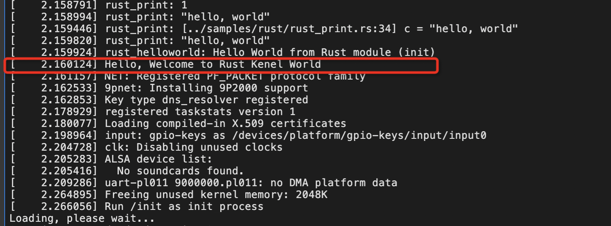

# Use bindgen to generate Rust bindings From C Code

## Write the kernel C code to generate rust symbols:

follow the tutorail https://github.com/rcore-os/rust-for-linux/blob/main/exercise3.md , write code
   

## Compile Kernel with Module Rust HelloWorld:

just use the symbols with  exercise2 Rust HelloWorld module ,Then compile Rust HelloWorld module .

 

## Boot the Kernel
Once compile completed,Run the following command with right path:

```qemu-system-aarch64 -machine 'virt' -cpu 'cortex-a57' -m 1G -device virtio-blk-device,drive=hd -drive file=$HOME/dqib_arm64-virt/image.qcow2,if=none,id=hd -device virtio-net-device,netdev=net -netdev user,id=net,hostfwd=tcp::2222-:22 -kernel arch/arm64/boot/Image.gz -initrd $HOME/dqib_arm64-virt/initrd -nographic -append "root=LABEL=rootfs console=ttyAMA0```


finally you can see the info about your log.


 
