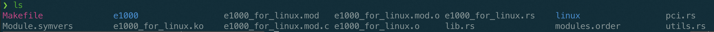
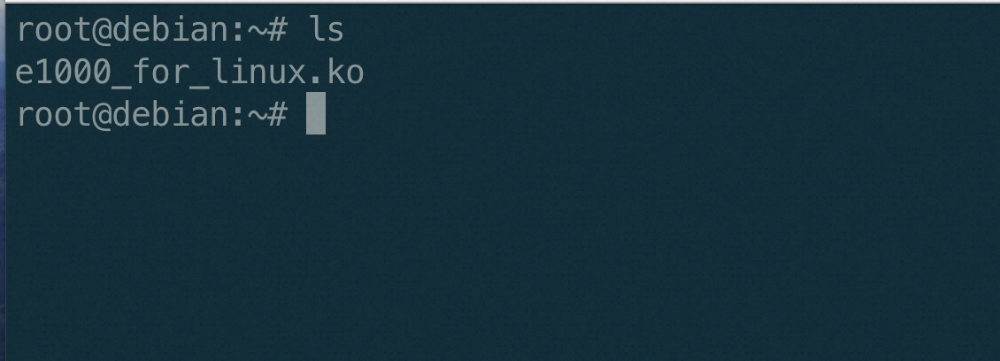
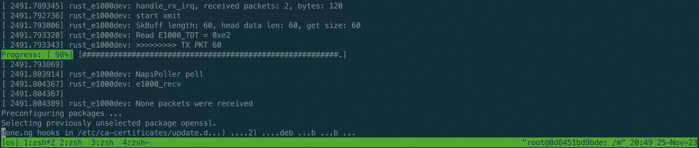

# E1000 send and receive packets

## Introduce for the e1000 driver

The e1000 network card driver is designed for Intel's PRO/1000 family of adapters. Below is a high-level overview of the principles and processes involved in the operation of the e1000 driver within the context of a Linux operating system. This description is not an exhaustive explanation but should provide you with a clear understanding of the key components and stages.

1. Initialization: 
   
When the e1000 driver is loaded into the kernel, either at boot time or through manual loading using the modprobe or insmod command, it initializes the network adapter by identifying it via PCI (Peripheral Component Interconnect) and mapping its memory and I/O regions into the kernel's address space.

2. Memory Allocation:

The driver allocates memory for the transmit descriptor ring (tx_ring) and receive descriptor ring (rx_ring), which will be used to store pointers to the data buffers that are to be transmitted or received. These descriptors will also contain status information and control bits used by the hardware.
Memory is also allocated for the transmit data buffers (tx_buffer) and receive data buffers (rx_buffer), where the actual packet data will be stored.
For both the descriptor rings and the data buffers, the driver ensures that the memory is allocated in a way that is accessible by the Direct Memory Access (DMA) controller, so that the network card can read/write packet data directly to/from memory without CPU intervention. The driver will keep track of the DMA virtual addresses (for the driver's use) and the physical addresses (for the network card's use).

3. Descriptor Initialization: 

The driver initializes the descriptor rings with the DMA addresses of the data buffers, setting up the ownership and status fields accordingly.

4. Hardware Setup:

The driver programs the network adapter's registers with the physical addresses of the descriptor rings so that the adapter knows where to read/write descriptor information.
It configures various hardware settings such as the MAC address, buffer sizes, interrupt generation, and other parameters relevant to the operation of the network card.

5. Interrupt Handling: 
The e1000 driver uses interrupts to handle events such as packet reception, transmission completion, and errors. When an event occurs, the network card generates an interrupt that is caught by the CPU. The driver's interrupt service routine (ISR) is then called to handle the event, which may involve processing received packets or freeing up resources used by transmitted packets.

6. Transmission Process:

When the kernel's networking stack has a packet to send, it calls the driver's send function with the packet data.
The driver places the data in a free transmit buffer and updates the corresponding transmit descriptor with the buffer's DMA address and the packet length.
It then notifies the hardware that there is data ready to be sent by writing to a specific register.
The network card reads the descriptor, sends the packet, and updates the descriptor status to indicate completion.

7. Reception Process:

The network card, upon receiving a packet, places the data into a pre-allocated receive buffer and updates the corresponding receive descriptor.
It then generates an interrupt to signal the arrival of new data.
The driver's ISR handles the interrupt, processes the received packet (such as passing it up the networking stack), and makes the buffer available for receiving new data.
8. Shutdown: When the driver is unloaded or the system is shut down, the driver performs a cleanup process. It disables the network adapter's interrupts, releases any allocated memory for the descriptor rings and buffers, and unmaps the adapter's memory and I/O regions from the kernel's address space.


## complete exercise3 checkpoint 1-5
1. Allocate memory space for tx_ring and rx_ring and return the DMA virtual address and physical address

2. Allocate memory space for tx_buffer and rx_buffer and return the DMA virtual address and physical address

3. Set tx descriptor base address and tx ring length
   
4. Set tx descriptor base address and tx ring length
   
5. Enable interrupts
   - step1 set up irq_data
  
   - step2 request_irq
  
   - step3 set up irq_handler

 
##  complet exercise4 checkpoiont 1-2
1. complete handle_rx_irq&handle_tx_irq


2.  complete start_xmit （send and recv）


## Test your e1000 Driver

### Compile your e1000 Driver
Compile your driver module with kernel
which **disabled** the built-in e1000 driver.
first cd to the e1000linux directory:

```
make ARCH=riscv LLVM=1 O=build defconfig
make ARCH=riscv LLVM=1 O=build menuconfig  #disable e1000 driver
make ARCH=riscv LLVM=1 -j4
```
then in the driver src directory:
```
make KDIR=../../../e1000linux/linux/build/  LLVM=1  ARCH=riscv
```



### Boot the Kernel with QEMU
Once compile completed,Run the following command with right path:

```qemu-system-riscv64 -machine virt -cpu rv64 -m 1G -device virtio-blk-device,drive=hd -drive file=build/arch/riscv/dqib_riscv64-virt/image.qcow2,if=none,id=hd -device virtio-net-device,netdev=net -netdev user,id=net,hostfwd=tcp::2222-:22 -kernel build/arch/riscv/boot/Image -initrd build/arch/riscv/dqib_riscv64-virt/initrd -nographic -append "root=LABEL=rootfs console=ttyS0" -device e1000,netdev=net0,bus=pcie.0 -netdev user,id=net0 ```

once start, copy driver module from host to qemu with scp:



then we set the ip address of e1000 eth1 and disable eth0,using any network command,  you can see log about packet send and recv process.


 
